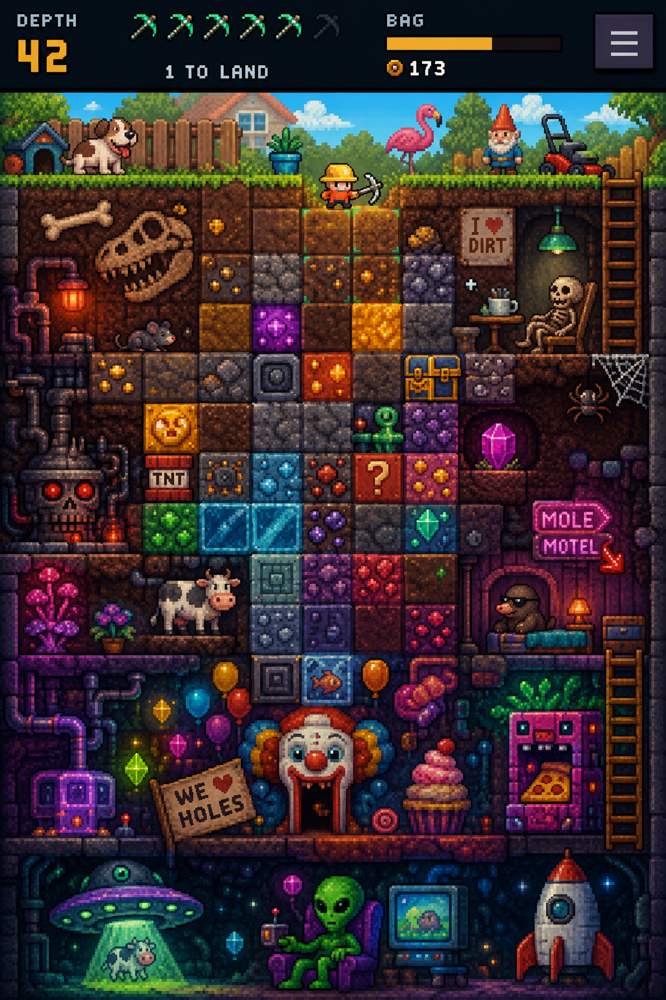

# DOWNSHAFT

You are a guy in your backyard with a pickaxe.

You start digging.

Under the lawn are dinosaur bones, buried rooms, impossible machines, a motel run by a mole,
a carnival beneath the earth, and eventually a UFO abducting a cow.

**Play it on your phone:** <https://junovhs.github.io/grapeghost/>

No install, no server, no account. The current prototype is a single `index.html`, published
whenever `main` is pushed.



---

## What it is

**DOWNSHAFT is a persistent puzzle-RPG about engineering collapses.**

It is not a free-form mining game.

The underground is divided into compact spatial problems, closer to individual puzzle-game
levels than an open sandbox. Each screen is readable as a whole: the walls, supports, loose
material, valuables, hazards and possible routes are all in front of you.

But the screens are not disposable levels selected from a menu. They are connected parts of
one continuous hole.

What you break stays broken. What falls stays where it lands. Objects can be left behind,
recovered later or carried deeper. Routes become shortcuts. Old problems can gain new
solutions when you return with different equipment.

You are not clearing levels.

You are excavating a place.

---

## The verb

Everything in the shaft is supported by the two side walls.

Rock connected to either wall is stable. Cut a formation free of both walls and the entire
mass collapses.

Stand on it and you ride it down.

Stand beneath it and you are buried.

Dirt slides. Ice carries things sideways. Roots grow back. Pipes release water, steam or
pressure. Webs catch falling objects. Balloons make masses rise instead of fall. Beams anchor
structures in place. Explosives solve one problem while destroying three opportunities.

Before committing, the game previews the exact result.

The central question is never merely:

> Which tile should I break?

It is:

> What happens if I cut this?

---

## The loop

Each screen gives you a limited number of meaningful actions.

Picks are a decision budget, not a real-time fuel meter. Every cut should accomplish something:
release a mass, expose a route, preserve a find, move an object, trigger a machine, rescue a
creature or create a position from which the next cut becomes possible.

A typical sequence is:

1. Enter a compact section of the shaft.
2. Read its structure, valuables, hazards and exits.
3. Position yourself.
4. Preview a cut and its consequences.
5. Commit.
6. Ride, evade, redirect or exploit the collapse.
7. Collect, carry, use, drop or preserve what remains.
8. Leave the screen permanently changed.
9. Continue toward the next camp, side room or depth band.

The immediate interaction should be understandable in seconds.

The consequences should remain interesting for hundreds of hours.

---

## The world around the puzzle

DOWNSHAFT aims for the abundance and attachment of a long-form life RPG, but every system must
serve the excavation.

Resources are not interchangeable colored money. Copper conducts power. Iron makes supports.
Ice changes movement. Roots regrow. Fossils are fragile multi-cell objects that must be
excavated intact.

Tools do not merely increase damage numbers. They add new physical operations:

- a chisel removes one exact cell;
- a sledgehammer pushes a mass sideways;
- a beam anchors a formation;
- a rope tethers the player or an object;
- a jack raises something one cell;
- a balloon reverses gravity;
- a magnet pulls metal through open space;
- TNT removes a large area and threatens everything nearby.

Clothing changes which risks you can tolerate. Consumables temporarily alter a board’s rules.
Creatures act inside the same spatial system rather than starting a separate combat game.

The player should gradually acquire a richer language for manipulating the world.

---

## Home and expeditions

The backyard is the center of the game.

It is where you return, store equipment, prepare expeditions, change clothes, improve tools
and display what you have recovered.

A garden gnome dug out of the earth can stand on the lawn. Fossils can be reconstructed.
Impossible plants can grow in pots. Machinery, decorations, signs and rescued objects become
a visible record of this particular hole and the person who dug it.

Underground camps are rare and widely separated. Reaching one should feel like establishing a
real foothold, not touching a checkpoint every few screens.

Camps extend an expedition.

They do not replace home.

---

## The descent

The world begins ordinary and becomes impossible without ever becoming grim.

A rough progression:

| Region         | What changes                                                          |
| -------------- | --------------------------------------------------------------------- |
| The backyard   | An ordinary afternoon. Nothing is wrong yet.                          |
| Topsoil        | Loose dirt, simple collapses and fossils beneath the lawn.            |
| Buried rooms   | Furniture, lamps and a skeleton drinking coffee.                      |
| Machinery      | Pipes, pressure, power networks and machines with faces.              |
| Caverns        | Living material, mushrooms, creatures and an unexplained cow.         |
| Mole territory | Lateral tunnels, residents and a neon underground motel.              |
| Carnival       | Balloons, strange vending machines and doors inside clown mouths.     |
| Space          | Tractor beams, alien materials, a rocket and the cow’s eventual fate. |

The humor is played straight.

The mole really operates a motel. The skeleton really has a coffee table. The alien really
watches television in an armchair. Nobody stops to explain why any of this is beneath your
yard.

---

## Design laws

### Phone-native or it does not count

The game is designed for portrait play with one thumb. The entire current problem must remain
legible on a phone screen.

### The preview is a promise

Any committed action with significant consequences must show the player what it will do.
Difficulty should come from choosing among consequences, not from guessing what the simulation
means.

### The tap is the product

A mechanic is not complete when its state changes correctly. It ships with impact, motion,
particles, shake, sound and readable feedback.

There is no hypothetical later polish pass.

### Breadth must return to the core

Resources, equipment, clothing, residents, crafting, rooms, shops and collectibles are welcome
only when they do at least one of two things:

1. change how the player reads, manipulates, survives, preserves or profits from a structural
   puzzle; or
2. make the persistent world worth caring about.

### Three minutes to pick up, five hundred hours deep

A short session should produce something permanent.

Long-term mastery should come from understanding the world, combining tools, planning
expeditions and recognizing possibilities that were invisible to a new player.

---

## Repository

| Path                           | Purpose                                                                         |
| ------------------------------ | ------------------------------------------------------------------------------- |
| `index.html`                   | The current playable prototype. One file, no dependencies and no build step.    |
| `docs/design.md`               | The authoritative design document. Read this first.                             |
| `docs/game-systems-plan.md`    | Current systems, progression and production plan.                               |
| `docs/north-star.png`          | The visual and tonal reference of record.                                       |
| `docs/north-star-catalogue.md` | A complete inventory of the objects and ideas depicted in the North Star image. |
| `docs/philosophy.md`           | The designer’s project-independent game preferences.                            |

---

## Decisions and open questions

Project decisions live in Ishoo rather than being duplicated across markdown files.

```sh
ishoo decision list
ishoo plan show downshaft
ishoo status
```

```

The documents describe the destination.

Ishoo records what has been decided, what remains uncertain and what should be built next.

---

## Status

DOWNSHAFT is a playable prototype.

The current build already contains the shaft, structural support, collapse simulation,
persistent excavation, several material bands, finds, lift access and an early economy.

The larger game described here remains aspirational.

The central design question is still the one that decides the entire project:

> Can cutting, collapsing, riding and redirecting the underground become deep enough to support
> a long-lived world without turning into repetition?

Everything else exists to give that question more interesting answers.
```
